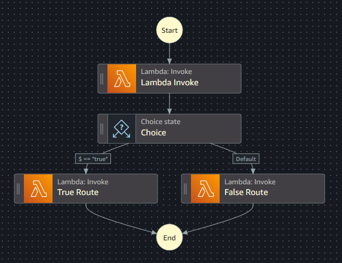

# Exercise #14: Create AWS Step Function Using Terraform

<ins>Part 1</ins>

* Walk through the tutorial available at https://catalog.workshops.aws/stepfunctions/en-US/development/iac/deploy-with-terraform
* This exercise helps you work through the process of creating a simple AWS Step Function with a single Lambda invocation

**NOTE: Part 1 will be on your own (but feel free to ask any questions). Parts 2 and 3 will be a code-along walkthrough with the instructor during the class.**

<ins>Part 2</ins>

* Once you have the simple Step Function operational, try expanding the flow using some of what you've learned throughout the course and in part 1 of the exercise
* In your `src` folder, change your `lambda.py` to contain:

```
def lambda_handler(event, context):
# My super Lambda function
    return event["decision"]
```

* In your `src` folder, add a new `true-route.py` and update its contents to:

```
def lambda_handler(event, context):
# My super Lambda function
    return "Good to Go!"
```

* In your `src` folder, add a new `false-route.py` and update its contents to:

```
def lambda_handler(event, context):
# My super Lambda function
    return "NO GO!"
```

* Update your Step Function, to use the results from the `lambda.py` logic to trigger a choice route - if the result of `lambda.py` is "true", your Step Function should route to the `true-route.py` logic; if "false" (or anything else), your Step Function should route to the `false-route.py`



<ins>Part 3</ins>

* Enhance your Terrform implementation by creating a module for the Lambdas, allowing you to reuse code and cut down on the amount of repeated logic required